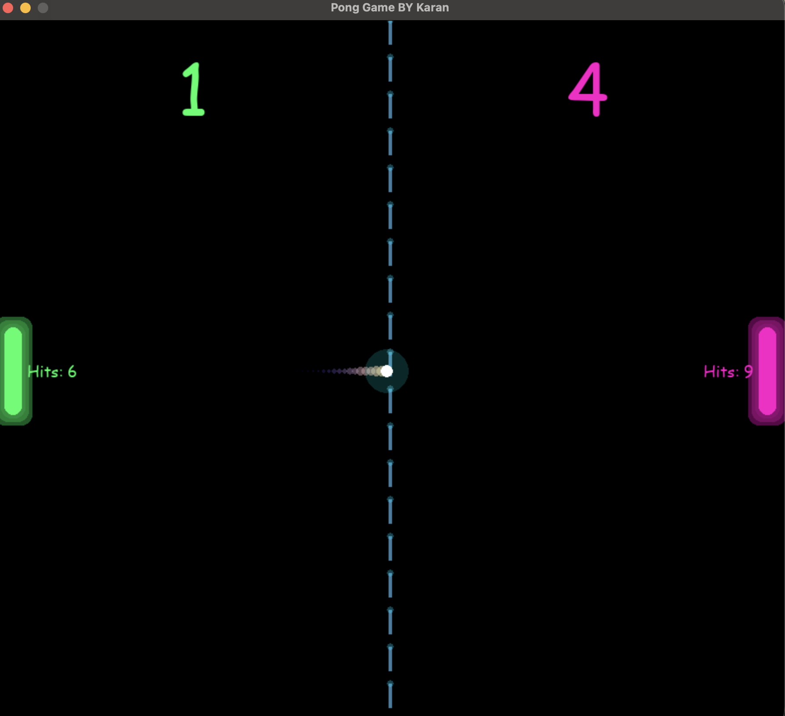
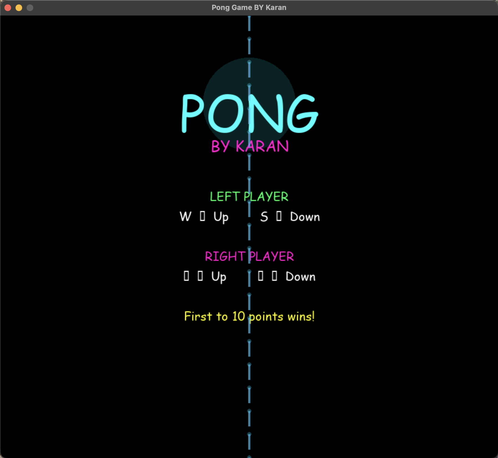
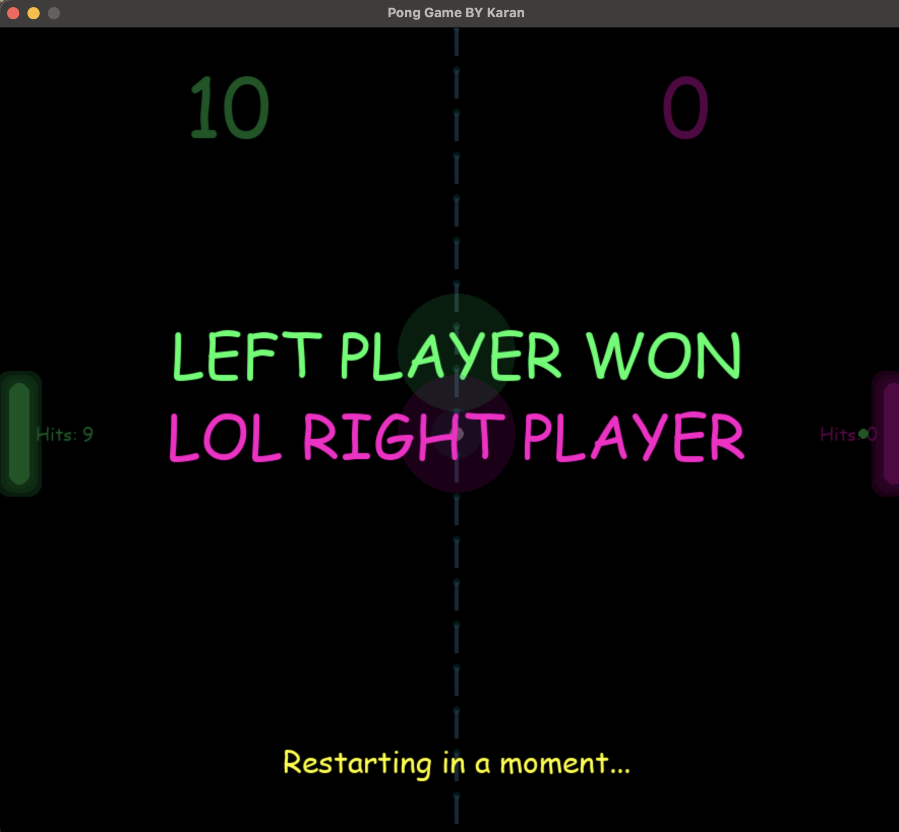

# Pong Game by Karan

A futuristic Pong game built using Python and Pygame.

## Features

- Neon UI
- Ball trail effect
- Particle effects
- Screen shake
- Countdown system
- Winner popup
- Increasing ball speed

## Controls

### Left Player

- W = Move Up
- S = Move Down

### Right Player

- ↑ = Move Up
- ↓ = Move Down

## Technologies Used

- Python
- Pygame

## How to Run

```bash
pip install pygame
python main.py
```

# Pong Game by Karan

A futuristic Pong game built with Python and Pygame.

## Gameplay



## Start Screen



## Winner Screen


